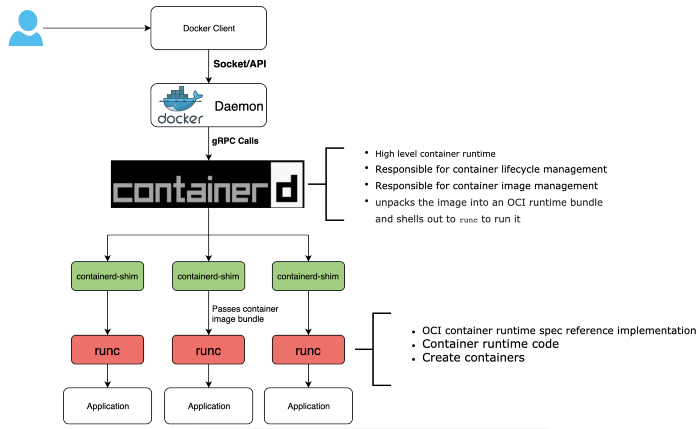

- [What's container](#whats-container)
  - [OverlayFS create image ROOTFS.](#overlayfs-create-image-rootfs)
  - [OverlayFS CoW create a writable layer, on top of image layer, as container layer](#overlayfs-cow-create-a-writable-layer-on-top-of-image-layer-as-container-layer)
  - [Linux namespace provides isolation](#linux-namespace-provides-isolation)
- [Docker and OCI runtime](#docker-and-oci-runtime)
  - [docker engine architecture](#docker-engine-architecture)
    - [dockerd](#dockerd)
    - [containerd](#containerd)
    - [container-shim](#container-shim)
    - [runc](#runc)
    - [libcontainer](#libcontainer)
  - [From pstree view](#from-pstree-view)
  - [docker run under the hood](#docker-run-under-the-hood)
    - [Overview flow](#overview-flow)
    - [logs](#logs)
- [Reference](#reference)
# What's container
> From redhat io[1] <br>
A container is a **sandboxed runtime environment** that exists on a Linux system. The sandbox is constructed using utilities that exist in the Linux Kernel. Applications running in this sandbox share a Kernel with their host, but certain parts of the Kernel that store machine state are abstracted through namespaces. 

Namespaces allow the isolated environment to have a different state than the host even though they are sharing a Kernel.

The contents of the filesystem are typically provided by an image file.

Ideally, **the software that is run in this sandbox should not recognize it is in a sandbox**. 

## OverlayFS create image ROOTFS. 
Image layer is write only. Refer to [CoW and OverlayFS](../linux/CoW%20and%20OverlayFS.md)
## OverlayFS CoW create a writable layer, on top of image layer, as container layer
## Linux namespace provides isolation
Refer to [Linux namespaces](../linux/Linux%20namespaces.md). 
- use mnt namespace to mount the image ROOTFS to image layer.
- Network stack can be created with net namespace
- 
# Docker and OCI runtime
## docker engine architecture
The image is copied from https://medium.com/@avijitsarkar123/docker-and-oci-runtimes-a9c23a5646d6

### dockerd
- listens for Docker API requests 
- docker image management, image builds
- authentication
- security
- core networking
- orchestration (docker swarm)
### containerd
- manage container lifecycle
- manage image
- mange storage
- reparent the container proces to the shim 
- converts the required Docker image into an OCI bundle and tells runc to use this to create a new container.
### container-shim 
- sit between containerd and runc. 
- Enable daemonless containers.
  - is to monitor stdin(out) and report back the error code returned from exiting the container. 
  - container process is attached to container-shim not dockerd. so if dockerd/containerd died, the containers doesn't died.
  - It allows the container's exit status to be reported back to a higher level tool like docker without having the be the actual parent of the container's process and do a wait4.

### runc
runc is a command line client for running applications packaged according to the OCI format and is a compliant implementation of the OCI spec. 
- Container runtime
- Interface to kernal primitives (Linux capabilities like cgroups, namespaces, etc…)
- runc run the container. after the container is run, the runc exits.  (allowing us to not have any long-running processes responsible for our containers)
- small, lightweight CLI wrapper for libcontainer
```bash
root@ubuntu20:~# runc list
ID          PID         STATUS      BUNDLE      CREATED     OWNER
root@ubuntu20:~# runc --root /run/docker/runtime-runc/moby/ list
ID                                                                 PID         STATUS      BUNDLE                                                                                                                CREATED                          OWNER
d25eefb5816703ac6209a57e9ba9f0aac61277e65426a55648fb75c03896f270   8756        running     /run/containerd/io.containerd.runtime.v2.task/moby/d25eefb5816703ac6209a57e9ba9f0aac61277e65426a55648fb75c03896f270   2021-11-02T16:52:02.869464192Z   root
```
### libcontainer
Orginally replace LXC as the interface layer with the host OS
## From pstree view
```bash
$ pstree -ap
systemd,1
  ├─containerd,7648
  │   ├─{containerd},7649
  │   ├─{containerd},7650
  │   ├─...
  ├─containerd-shim,7857 -namespace moby -id 36efe1cad5e90ad14da8c92e814ab89bddcaa63d86c72c64becbe0c547bf2ffd -address /run/containerd/containerd.sock
  │   ├─nginx,7882
  │   │   ├─nginx,7948
  │   │   ├─...
  │   ├─{containerd-shim},7859
  │   ├─...
  ├─dockerd,7663 -H fd:// --containerd=/run/containerd/containerd.sock
  │   ├─docker-proxy,7842 -proto tcp -host-ip 0.0.0.0 -host-port 8081 -container-ip 172.17.0.2 -container-port 80
  │   │   ├─...
  │   ├─{dockerd},7664
  │   ├─...
```
the container process (nginx) is forked from containerd-shim, and containerd-shim is forked from systemd. 
## docker run under the hood
### Overview flow
> Copy from book: docker deep dive

### logs
```bash
Nov 02 14:23:10 ubuntu20.04 dockerd[6665]: time="2021-11-02T14:23:10.768985874Z" level=debug msg="Calling POST /v1.41/containers/create"
Nov 02 14:23:10 ubuntu20.04 dockerd[6665]: time="2021-11-02T14:23:10.769325989Z" level=debug msg="form data: {\"AttachStderr\":false,\"AttachStdin\":false,\"AttachStdout\":false,\"Cmd\":null,\"Domainname\":\"\",\"Entrypoint\":null,\"Env\":null,\"ExposedPorts\":{\"80/tcp\":{}},\"HostConfig\":{\"AutoRemove\":false,\"Binds\":null,\"BlkioDeviceReadBps\":null,\"BlkioDeviceReadIOps\":null,\"BlkioDeviceWriteBps\":null,\"BlkioDeviceWriteIOps\":null,\"BlkioWeight\":0,\"BlkioWeightDevice\":[],\"CapAdd\":null,\"CapDrop\":null,\"Cgroup\":\"\",\"CgroupParent\":\"\",\"CgroupnsMode\":\"\",\"ConsoleSize\":[0,0],\"ContainerIDFile\":\"\",\"CpuCount\":0,\"CpuPercent\":0,\"CpuPeriod\":0,\"CpuQuota\":0,\"CpuRealtimePeriod\":0,\"CpuRealtimeRuntime\":0,\"CpuShares\":0,\"CpusetCpus\":\"\",\"CpusetMems\":\"\",\"DeviceCgroupRules\":null,\"DeviceRequests\":null,\"Devices\":[],\"Dns\":[],\"DnsOptions\":[],\"DnsSearch\":[],\"ExtraHosts\":null,\"GroupAdd\":null,\"IOMaximumBandwidth\":0,\"IOMaximumIOps\":0,\"IpcMode\":\"\",\"Isolation\":\"\",\"KernelMemory\":0,\"KernelMemoryTCP\":0,\"Links\":null,\"LogConfig\":{\"Config\":{},\"Type\":\"\"},\"MaskedPaths\":null,\"Memory\":0,\"MemoryReservation\":0,\"MemorySwap\":0,\"MemorySwappiness\":-1,\"NanoCpus\":0,\"NetworkMode\":\"default\",\"OomKillDisable\":false,\"OomScoreAdj\":0,\"PidMode\":\"\",\"PidsLimit\":0,\"PortBindings\":{\"80/tcp\":[{\"HostIp\":\"\",\"HostPort\":\"8081\"}]},\"Privileged\":false,\"PublishAllPorts\":false,\"ReadonlyPaths\":null,\"ReadonlyRootfs\":false,\"RestartPolicy\":{\"MaximumRetryCount\":0,\"Name\":\"no\"},\"SecurityOpt\":null,\"ShmSize\":0,\"UTSMode\":\"\",\"Ulimits\":null,\"UsernsMode\":\"\",\"VolumeDriver\":\"\",\"VolumesFrom\":null},\"Hostname\":\"\",\"Image\":\"nginx\",\"Labels\":{},\"NetworkingConfig\":{\"EndpointsConfig\":{}},\"OnBuild\":null,\"OpenStdin\":false,\"Platform\":null,\"StdinOnce\":false,\"Tty\":false,\"User\":\"\",\"Volumes\":{},\"WorkingDir\":\"\"}"
```
```bash
Nov 02 14:23:10 ubuntu20.04 dockerd[6665]: time="2021-11-02T14:23:10.771848224Z" level=debug msg="Calling GET /v1.41/info"
Nov 02 14:23:10 ubuntu20.04 dockerd[6665]: time="2021-11-02T14:23:10.788696680Z" level=debug msg="Calling POST /v1.41/images/create?fromImage=nginx&tag=latest"
Nov 02 14:23:10 ubuntu20.04 dockerd[6665]: time="2021-11-02T14:23:10.793430842Z" level=debug msg="Trying to pull nginx from https://registry-1.docker.io v2"
Nov 02 14:23:11 ubuntu20.04 containerd[6645]: time="2021-11-02T14:23:11.432030310Z" level=debug msg="(*service).Write started" expected="sha256:644a70516a26004c97d0d85c7fe1d0c3a67ea8ab7ddf4aff193d9f301670cf36" ref="index-sha256:644a70516a26004c97d0d85c7fe1d0c3a67ea8ab7ddf4aff193d9f301670cf36" total=1862
Nov 02 14:23:11 ubuntu20.04 dockerd[6665]: time="2021-11-02T14:23:11.456196577Z" level=debug msg="Fetching manifest from remote" digest="sha256:644a70516a26004c97d0d85c7fe1d0c3a67ea8ab7ddf4aff193d9f301670cf36" error="<nil>" remote="docker.io/library/nginx:latest"
Nov 02 14:23:11 ubuntu20.04 dockerd[6665]: time="2021-11-02T14:23:11.665570753Z" level=debug msg="Pulling ref from V2 registry: nginx:latest"
Nov 02 14:23:11 ubuntu20.04 dockerd[6665]: time="2021-11-02T14:23:11.665637848Z" level=debug msg="docker.io/library/nginx:latest resolved to a manifestList object with 8 entries; looking for a unknown/amd64 match"
Nov 02 14:23:11 ubuntu20.04 dockerd[6665]: time="2021-11-02T14:23:11.665660535Z" level=debug msg="found match for linux/amd64 with media type application/vnd.docker.distribution.manifest.v2+json, digest sha256:7250923ba3543110040462388756ef099331822c6172a050b12c7a38361ea46f"
Nov 02 14:23:11 ubuntu20.04 containerd[6645]: time="2021-11-02T14:23:11.666715217Z" level=debug msg="(*service).Write started" expected="sha256:7250923ba3543110040462388756ef099331822c6172a050b12c7a38361ea46f" ref="manifest-sha256:7250923ba3543110040462388756ef099331822c6172a050b12c7a38361ea46f" total=1570
Nov 02 14:23:11 ubuntu20.04 dockerd[6665]: time="2021-11-02T14:23:11.689681638Z" level=debug msg="Fetching manifest from remote" digest="sha256:644a70516a26004c97d0d85c7fe1d0c3a67ea8ab7ddf4aff193d9f301670cf36" error="<nil>" remote="docker.io/library/nginx:latest"
Nov 02 14:23:11 ubuntu20.04 dockerd[6665]: time="2021-11-02T14:23:11.884719500Z" level=debug msg="pulling blob \"sha256:b380bbd43752f83945df8b5d1074fef8dd044820e7d3aef33b655a2483e030c7\""
Nov 02 14:23:11 ubuntu20.04 dockerd[6665]: time="2021-11-02T14:23:11.885151177Z" level=debug msg="pulling blob \"sha256:fca7e12d1754baddbd07178dd1693c726e9d792c0c9659208e3f4b474dc41a7c\""
Nov 02 14:23:11 ubuntu20.04 dockerd[6665]: time="2021-11-02T14:23:11.885526197Z" level=debug msg="pulling blob \"sha256:745ab57616cb3c803b3a00c3bd46fd0d94762bd5b9446eadc877cb7400fb6c11\""
Nov 02 14:23:12 ubuntu20.04 dockerd[6665]: time="2021-11-02T14:23:12.407293513Z" level=debug msg="Downloaded 745ab57616cb to tempfile /var/lib/docker/tmp/GetImageBlob556186693"
Nov 02 14:23:12 ubuntu20.04 dockerd[6665]: time="2021-11-02T14:23:12.408347873Z" level=debug msg="pulling blob \"sha256:a4723e260b6fedec963910b3ae53e939fd58cbad8232258576ba26765cdcf522\""
Nov 02 14:23:13 ubuntu20.04 dockerd[6665]: time="2021-11-02T14:23:13.145758967Z" level=debug msg="Downloaded a4723e260b6f to tempfile /var/lib/docker/tmp/GetImageBlob087017184"
Nov 02 14:23:13 ubuntu20.04 dockerd[6665]: time="2021-11-02T14:23:13.145848619Z" level=debug msg="pulling blob \"sha256:1c84ebdff6819c01d0dc43a59ee391cc2cb14f7aba20cac0af1b04fb78652fc9\""
Nov 02 14:23:14 ubuntu20.04 dockerd[6665]: time="2021-11-02T14:23:14.158990216Z" level=debug msg="Downloaded 1c84ebdff681 to tempfile /var/lib/docker/tmp/GetImageBlob109978815"
Nov 02 14:23:14 ubuntu20.04 dockerd[6665]: time="2021-11-02T14:23:14.159837074Z" level=debug msg="pulling blob \"sha256:858292fd2e56e240ab472db6e9fabd5fd390486660978fcf8d65a06a04c00971\""
Nov 02 14:23:14 ubuntu20.04 dockerd[6665]: time="2021-11-02T14:23:14.685334420Z" level=debug msg="Downloaded 858292fd2e56 to tempfile /var/lib/docker/tmp/GetImageBlob152919826"
Nov 02 14:23:16 ubuntu20.04 dockerd[6665]: time="2021-11-02T14:23:16.384404890Z" level=debug msg="Downloaded b380bbd43752 to tempfile /var/lib/docker/tmp/GetImageBlob192256347"
Nov 02 14:23:16 ubuntu20.04 dockerd[6665]: time="2021-11-02T14:23:16.385704598Z" level=debug msg="Using /usr/bin/unpigz to decompress"
Nov 02 14:23:16 ubuntu20.04 dockerd[6665]: time="2021-11-02T14:23:16.386999501Z" level=debug msg="Applying tar in /var/lib/docker/overlay2/96fbd727c19d0255f93a1a9c8fdfd5c6bffe11aee85cefbc44efd6f67b7d237e/diff" storage-driver=overlay2
Nov 02 14:23:16 ubuntu20.04 dockerd[6665]: time="2021-11-02T14:23:16.979891911Z" level=debug msg="Downloaded fca7e12d1754 to tempfile /var/lib/docker/tmp/GetImageBlob791636734"
Nov 02 14:23:17 ubuntu20.04 dockerd[6665]: time="2021-11-02T14:23:17.804308891Z" level=debug msg="Applied tar sha256:e81bff2725dbc0bf2003db10272fef362e882eb96353055778a66cda430cf81b to 96fbd727c19d0255f93a1a9c8fdfd5c6bffe11aee85cefbc44efd6f67b7d237e, size: 69250672"
Nov 02 14:23:17 ubuntu20.04 dockerd[6665]: time="2021-11-02T14:23:17.862027126Z" level=debug msg="Using /usr/bin/unpigz to decompress"
Nov 02 14:23:17 ubuntu20.04 dockerd[6665]: time="2021-11-02T14:23:17.863898583Z" level=debug msg="Applying tar in /var/lib/docker/overlay2/ba56fcfc621159d65798de066ef467db638cbdcce1dac75bd6d234aa00174fea/diff" storage-driver=overlay2
Nov 02 14:23:18 ubuntu20.04 dockerd[6665]: time="2021-11-02T14:23:18.570108961Z" level=debug msg="Applied tar sha256:43f4e41372e42dd32309f6a7bdce03cf2d65b3ca34b1036be946d53c35b503ab to ba56fcfc621159d65798de066ef467db638cbdcce1dac75bd6d234aa00174fea, size: 64017668"
Nov 02 14:23:18 ubuntu20.04 dockerd[6665]: time="2021-11-02T14:23:18.634466041Z" level=debug msg="Using /usr/bin/unpigz to decompress"
Nov 02 14:23:18 ubuntu20.04 dockerd[6665]: time="2021-11-02T14:23:18.636973611Z" level=debug msg="Applying tar in /var/lib/docker/overlay2/edfb07ca755cee54693fe558b505cb98e6c5d601dbe240f20aa4d9f5b54b3079/diff" storage-driver=overlay2
Nov 02 14:23:18 ubuntu20.04 dockerd[6665]: time="2021-11-02T14:23:18.701911109Z" level=debug msg="Applied tar sha256:788e89a4d186f3614bfa74254524bc2e2c6de103698aeb1cb044f8e8339a90bd to edfb07ca755cee54693fe558b505cb98e6c5d601dbe240f20aa4d9f5b54b3079, size: 1202"
Nov 02 14:23:18 ubuntu20.04 dockerd[6665]: time="2021-11-02T14:23:18.741915987Z" level=debug msg="Using /usr/bin/unpigz to decompress"
Nov 02 14:23:18 ubuntu20.04 dockerd[6665]: time="2021-11-02T14:23:18.744324478Z" level=debug msg="Applying tar in /var/lib/docker/overlay2/77e795dfadee523b892ad48786d3e30ab705094fbc188d1221c567480ba9d76b/diff" storage-driver=overlay2
Nov 02 14:23:18 ubuntu20.04 dockerd[6665]: time="2021-11-02T14:23:18.804182112Z" level=debug msg="Applied tar sha256:f8e880dfc4ef19e78853c3f132166a4760a220c5ad15b9ee03b22da9c490ae3b to 77e795dfadee523b892ad48786d3e30ab705094fbc188d1221c567480ba9d76b, size: 1961"
Nov 02 14:23:18 ubuntu20.04 dockerd[6665]: time="2021-11-02T14:23:18.839826508Z" level=debug msg="Using /usr/bin/unpigz to decompress"
Nov 02 14:23:18 ubuntu20.04 dockerd[6665]: time="2021-11-02T14:23:18.841331672Z" level=debug msg="Applying tar in /var/lib/docker/overlay2/12819fcbb0413dc488f3d531f3b49f2c9537dd27cebead34e8cb77e2006c49e1/diff" storage-driver=overlay2
Nov 02 14:23:18 ubuntu20.04 dockerd[6665]: time="2021-11-02T14:23:18.903792813Z" level=debug msg="Applied tar sha256:f7e00b807643e512b85ef8c9f5244667c337c314fa29572206c1b0f3ae7bf122 to 12819fcbb0413dc488f3d531f3b49f2c9537dd27cebead34e8cb77e2006c49e1, size: 1037"
Nov 02 14:23:18 ubuntu20.04 dockerd[6665]: time="2021-11-02T14:23:18.942986868Z" level=debug msg="Using /usr/bin/unpigz to decompress"
Nov 02 14:23:18 ubuntu20.04 dockerd[6665]: time="2021-11-02T14:23:18.945273881Z" level=debug msg="Applying tar in /var/lib/docker/overlay2/7aec4b7a7ee83976213d8bfec49ed293049b31b7ebd803f8e55e2b070067ab93/diff" storage-driver=overlay2
Nov 02 14:23:19 ubuntu20.04 dockerd[6665]: time="2021-11-02T14:23:19.005914633Z" level=debug msg="Applied tar sha256:9959a332cf6e41253a9cd0c715fa74b01db1621b4d16f98f4155a2ed5365da4a to 7aec4b7a7ee83976213d8bfec49ed293049b31b7ebd803f8e55e2b070067ab93, size: 4613"
Nov 02 14:23:19 ubuntu20.04 dockerd[6665]: time="2021-11-02T14:23:19.055090297Z" level=debug msg="Adding content digest to lease" digest="sha256:644a70516a26004c97d0d85c7fe1d0c3a67ea8ab7ddf4aff193d9f301670cf36" lease="moby-image-sha256:87a94228f133e2da99cb16d653cd1373c5b4e8689956386c1c12b60a20421a02" remote="docker.io/library/nginx:latest"
Nov 02 14:23:19 ubuntu20.04 dockerd[6665]: time="2021-11-02T14:23:19.058000363Z" level=debug msg="Adding content digest to lease" digest="sha256:7250923ba3543110040462388756ef099331822c6172a050b12c7a38361ea46f" lease="moby-image-sha256:87a94228f133e2da99cb16d653cd1373c5b4e8689956386c1c12b60a20421a02" remote="docker.io/library/nginx:latest"
```
```bash
Nov 02 14:23:19 ubuntu20.04 dockerd[6665]: time="2021-11-02T14:23:19.076104080Z" level=debug msg="Calling POST /v1.41/containers/create"
Nov 02 14:23:19 ubuntu20.04 dockerd[6665]: time="2021-11-02T14:23:19.076418636Z" level=debug msg="form data: {\"AttachStderr\":false,\"AttachStdin\":false,\"AttachStdout\":false,\"Cmd\":null,\"Domainname\":\"\",\"Entrypoint\":null,\"Env\":null,\"ExposedPorts\":{\"80/tcp\":{}},\"HostConfig\":{\"AutoRemove\":false,\"Binds\":null,\"BlkioDeviceReadBps\":null,\"BlkioDeviceReadIOps\":null,\"BlkioDeviceWriteBps\":null,\"BlkioDeviceWriteIOps\":null,\"BlkioWeight\":0,\"BlkioWeightDevice\":[],\"CapAdd\":null,\"CapDrop\":null,\"Cgroup\":\"\",\"CgroupParent\":\"\",\"CgroupnsMode\":\"\",\"ConsoleSize\":[0,0],\"ContainerIDFile\":\"\",\"CpuCount\":0,\"CpuPercent\":0,\"CpuPeriod\":0,\"CpuQuota\":0,\"CpuRealtimePeriod\":0,\"CpuRealtimeRuntime\":0,\"CpuShares\":0,\"CpusetCpus\":\"\",\"CpusetMems\":\"\",\"DeviceCgroupRules\":null,\"DeviceRequests\":null,\"Devices\":[],\"Dns\":[],\"DnsOptions\":[],\"DnsSearch\":[],\"ExtraHosts\":null,\"GroupAdd\":null,\"IOMaximumBandwidth\":0,\"IOMaximumIOps\":0,\"IpcMode\":\"\",\"Isolation\":\"\",\"KernelMemory\":0,\"KernelMemoryTCP\":0,\"Links\":null,\"LogConfig\":{\"Config\":{},\"Type\":\"\"},\"MaskedPaths\":null,\"Memory\":0,\"MemoryReservation\":0,\"MemorySwap\":0,\"MemorySwappiness\":-1,\"NanoCpus\":0,\"NetworkMode\":\"default\",\"OomKillDisable\":false,\"OomScoreAdj\":0,\"PidMode\":\"\",\"PidsLimit\":0,\"PortBindings\":{\"80/tcp\":[{\"HostIp\":\"\",\"HostPort\":\"8081\"}]},\"Privileged\":false,\"PublishAllPorts\":false,\"ReadonlyPaths\":null,\"ReadonlyRootfs\":false,\"RestartPolicy\":{\"MaximumRetryCount\":0,\"Name\":\"no\"},\"SecurityOpt\":null,\"ShmSize\":0,\"UTSMode\":\"\",\"Ulimits\":null,\"UsernsMode\":\"\",\"VolumeDriver\":\"\",\"VolumesFrom\":null},\"Hostname\":\"\",\"Image\":\"nginx\",\"Labels\":{},\"NetworkingConfig\":{\"EndpointsConfig\":{}},\"OnBuild\":null,\"OpenStdin\":false,\"Platform\":null,\"StdinOnce\":false,\"Tty\":false,\"User\":\"\",\"Volumes\":{},\"WorkingDir\":\"\"}"
```
```bash
Nov 02 14:23:19 ubuntu20.04 systemd[1]: var-lib-docker-overlay2-ab010fa85991802844ce9b1beefa4c7090150f528a599f975c84db908bb8c099\x2dinit-merged.mount: Succeeded.
-- Subject: Unit succeeded
-- Defined-By: systemd
-- Support: http://www.ubuntu.com/support
-- 
-- The unit var-lib-docker-overlay2-ab010fa85991802844ce9b1beefa4c7090150f528a599f975c84db908bb8c099\x2dinit-merged.mount has successfully entered the 'dead' state.
Nov 02 14:23:19 ubuntu20.04 systemd[928]: var-lib-docker-overlay2-ab010fa85991802844ce9b1beefa4c7090150f528a599f975c84db908bb8c099\x2dinit-merged.mount: Succeeded.
-- Subject: Unit succeeded
-- Defined-By: systemd
-- Support: http://www.ubuntu.com/support
-- 
-- The unit UNIT has successfully entered the 'dead' state.
Nov 02 14:23:19 ubuntu20.04 dockerd[6665]: time="2021-11-02T14:23:19.604888050Z" level=debug msg="container mounted via layerStore: &{/var/lib/docker/overlay2/ab010fa85991802844ce9b1beefa4c7090150f528a599f975c84db908bb8c099/merged 0x563797c33f60 0x563797c33f60}" container=c9c734388b8a29131a1c9ea61d4f64b51afd7070e179a56fa190856d78ba3594
Nov 02 14:23:19 ubuntu20.04 dockerd[6665]: time="2021-11-02T14:23:19.628737132Z" level=debug msg="Calling POST /v1.41/containers/c9c734388b8a29131a1c9ea61d4f64b51afd7070e179a56fa190856d78ba3594/wait?condition=next-exit"
```
```bash
Nov 02 14:23:19 ubuntu20.04 dockerd[6665]: time="2021-11-02T14:23:19.629874254Z" level=debug msg="Calling POST /v1.41/containers/c9c734388b8a29131a1c9ea61d4f64b51afd7070e179a56fa190856d78ba3594/start"
Nov 02 14:23:19 ubuntu20.04 dockerd[6665]: time="2021-11-02T14:23:19.632152219Z" level=debug msg="container mounted via layerStore: &{/var/lib/docker/overlay2/ab010fa85991802844ce9b1beefa4c7090150f528a599f975c84db908bb8c099/merged 0x563797c33f60 0x563797c33f60}" container=c9c734388b8a29131a1c9ea61d4f64b51afd7070e179a56fa190856d78ba3594
```

```bash
Nov 02 14:23:19 ubuntu20.04 dockerd[6665]: time="2021-11-02T14:23:19.633298787Z" level=debug msg="Assigning addresses for endpoint peaceful_ellis's interface on network bridge"
Nov 02 14:23:19 ubuntu20.04 dockerd[6665]: time="2021-11-02T14:23:19.633745207Z" level=debug msg="RequestAddress(LocalDefault/172.17.0.0/16, <nil>, map[])"
Nov 02 14:23:19 ubuntu20.04 dockerd[6665]: time="2021-11-02T14:23:19.634048317Z" level=debug msg="Request address PoolID:172.17.0.0/16 App: ipam/default/data, ID: LocalDefault/172.17.0.0/16, DBIndex: 0x0, Bits: 65536, Unselected: 65532, Sequence: (0xe0000000, 1)->(0x0, 2046)->(0x1, 1)->end Curr:4 Serial:false PrefAddress:<nil> "
Nov 02 14:23:19 ubuntu20.04 systemd-udevd[7338]: ethtool: autonegotiation is unset or enabled, the speed and duplex are not writable.
Nov 02 14:23:19 ubuntu20.04 systemd-udevd[7338]: Using default interface naming scheme 'v245'.
Nov 02 14:23:19 ubuntu20.04 networkd-dispatcher[597]: WARNING:Unknown index 17 seen, reloading interface list
Nov 02 14:23:19 ubuntu20.04 systemd-udevd[7338]: veth2ab7221: Could not generate persistent MAC: No data available
Nov 02 14:23:19 ubuntu20.04 systemd-udevd[7339]: ethtool: autonegotiation is unset or enabled, the speed and duplex are not writable.
Nov 02 14:23:19 ubuntu20.04 systemd-udevd[7339]: Using default interface naming scheme 'v245'.
Nov 02 14:23:19 ubuntu20.04 systemd-udevd[7339]: vethec81b2a: Could not generate persistent MAC: No data available
Nov 02 14:23:19 ubuntu20.04 kernel: docker0: port 2(vethec81b2a) entered blocking state
Nov 02 14:23:19 ubuntu20.04 kernel: docker0: port 2(vethec81b2a) entered disabled state
Nov 02 14:23:19 ubuntu20.04 kernel: device vethec81b2a entered promiscuous mode
Nov 02 14:23:19 ubuntu20.04 systemd-networkd[398]: vethec81b2a: Link UP
Nov 02 14:23:19 ubuntu20.04 dockerd[6665]: time="2021-11-02T14:23:19.650729199Z" level=debug msg="Assigning addresses for endpoint peaceful_ellis's interface on network bridge"
Nov 02 14:23:19 ubuntu20.04 dockerd[6665]: time="2021-11-02T14:23:19.663152953Z" level=debug msg="Programming external connectivity on endpoint peaceful_ellis (a05e57ff135005e6adc57a8b000aa4c83cf714b39cf3cf3206f38e51499f72a6)"
Nov 02 14:23:19 ubuntu20.04 dockerd[6665]: time="2021-11-02T14:23:19.663279498Z" level=debug msg="/usr/sbin/iptables, [--wait -t nat -C DOCKER -p tcp -d 0/0 --dport 8081 -j DNAT --to-destination 172.17.0.3:80 ! -i docker0]"
Nov 02 14:23:19 ubuntu20.04 dockerd[6665]: time="2021-11-02T14:23:19.668384787Z" level=debug msg="/usr/sbin/iptables, [--wait -t nat -A DOCKER -p tcp -d 0/0 --dport 8081 -j DNAT --to-destination 172.17.0.3:80 ! -i docker0]"
Nov 02 14:23:19 ubuntu20.04 dockerd[6665]: time="2021-11-02T14:23:19.670689300Z" level=debug msg="/usr/sbin/iptables, [--wait -t filter -C DOCKER ! -i docker0 -o docker0 -p tcp -d 172.17.0.3 --dport 80 -j ACCEPT]"
Nov 02 14:23:19 ubuntu20.04 dockerd[6665]: time="2021-11-02T14:23:19.672663970Z" level=debug msg="/usr/sbin/iptables, [--wait -t filter -A DOCKER ! -i docker0 -o docker0 -p tcp -d 172.17.0.3 --dport 80 -j ACCEPT]"
Nov 02 14:23:19 ubuntu20.04 dockerd[6665]: time="2021-11-02T14:23:19.674874454Z" level=debug msg="/usr/sbin/iptables, [--wait -t nat -C POSTROUTING -p tcp -s 172.17.0.3 -d 172.17.0.3 --dport 80 -j MASQUERADE]"
Nov 02 14:23:19 ubuntu20.04 dockerd[6665]: time="2021-11-02T14:23:19.677080691Z" level=debug msg="/usr/sbin/iptables, [--wait -t nat -A POSTROUTING -p tcp -s 172.17.0.3 -d 172.17.0.3 --dport 80 -j MASQUERADE]"
Nov 02 14:23:19 ubuntu20.04 dockerd[6665]: time="2021-11-02T14:23:19.685924474Z" level=debug msg="EnableService c9c734388b8a29131a1c9ea61d4f64b51afd7070e179a56fa190856d78ba3594 START"
Nov 02 14:23:19 ubuntu20.04 dockerd[6665]: time="2021-11-02T14:23:19.685992753Z" level=debug msg="EnableService c9c734388b8a29131a1c9ea61d4f64b51afd7070e179a56fa190856d78ba3594 DONE"
```
Docker mounts the container’s root filesystem inside the bundle
```bash
Nov 02 14:23:19 ubuntu20.04 dockerd[6665]: time="2021-11-02T14:23:19.694752497Z" level=debug msg="bundle dir created" bundle=/var/run/docker/containerd/c9c734388b8a29131a1c9ea61d4f64b51afd7070e179a56fa190856d78ba3594 module=libcontainerd namespace=moby root=/var/lib/docker/overlay2/ab010fa85991802844ce9b1beefa4c7090150f528a599f975c84db908bb8c099/merged
```
```bash
Nov 02 14:23:19 ubuntu20.04 containerd[6645]: time="2021-11-02T14:23:19.705341205Z" level=debug msg="event published" ns=moby topic=/containers/create type=containerd.events.ContainerCreate
Nov 02 14:23:19 ubuntu20.04 containerd[6645]: time="2021-11-02T14:23:19.722403708Z" level=info msg="starting signal loop" namespace=moby path=/run/containerd/io.containerd.runtime.v2.task/moby/c9c734388b8a29131a1c9ea61d4f64b51afd7070e179a56fa190856d78ba3594 pid=7385
Nov 02 14:23:19 ubuntu20.04 systemd[928]: run-docker-runtime\x2drunc-moby-c9c734388b8a29131a1c9ea61d4f64b51afd7070e179a56fa190856d78ba3594-runc.U0gU8V.mount: Succeeded.
-- Subject: Unit succeeded
-- Defined-By: systemd
-- Support: http://www.ubuntu.com/support
-- 
-- The unit UNIT has successfully entered the 'dead' state.
Nov 02 14:23:19 ubuntu20.04 systemd[1]: run-docker-runtime\x2drunc-moby-c9c734388b8a29131a1c9ea61d4f64b51afd7070e179a56fa190856d78ba3594-runc.U0gU8V.mount: Succeeded.
-- Subject: Unit succeeded
-- Defined-By: systemd
-- Support: http://www.ubuntu.com/support
-- 
-- The unit run-docker-runtime\x2drunc-moby-c9c734388b8a29131a1c9ea61d4f64b51afd7070e179a56fa190856d78ba3594-runc.U0gU8V.mount has successfully entered the 'dead' state.
Nov 02 14:23:19 ubuntu20.04 kernel: eth0: renamed from veth2ab7221
Nov 02 14:23:19 ubuntu20.04 systemd-networkd[398]: vethec81b2a: Gained carrier
Nov 02 14:23:19 ubuntu20.04 kernel: docker0: port 2(vethec81b2a) entered blocking state
Nov 02 14:23:19 ubuntu20.04 kernel: docker0: port 2(vethec81b2a) entered forwarding state
Nov 02 14:23:19 ubuntu20.04 dockerd[6665]: time="2021-11-02T14:23:19.976502979Z" level=debug msg="sandbox set key processing took 141.417961ms for container c9c734388b8a29131a1c9ea61d4f64b51afd7070e179a56fa190856d78ba3594"
```

```bash
Nov 02 14:23:20 ubuntu20.04 containerd[6645]: time="2021-11-02T14:23:20.009389277Z" level=debug msg="event forwarded" ns=moby topic=/tasks/create type=containerd.events.TaskCreate
Nov 02 14:23:20 ubuntu20.04 dockerd[6665]: time="2021-11-02T14:23:20.010326529Z" level=debug msg=event module=libcontainerd namespace=moby topic=/tasks/create
Nov 02 14:23:20 ubuntu20.04 containerd[6645]: time="2021-11-02T14:23:20.026219519Z" level=debug msg="garbage collected" d=2.016925ms
```

```bash
Nov 02 14:23:20 ubuntu20.04 containerd[6645]: time="2021-11-02T14:23:20.031920571Z" level=debug msg="event forwarded" ns=moby topic=/tasks/start type=containerd.events.TaskStart
Nov 02 14:23:20 ubuntu20.04 dockerd[6665]: time="2021-11-02T14:23:20.032396470Z" level=debug msg=event module=libcontainerd namespace=moby topic=/tasks/start
```


# Reference
http://redhatgov.io/workshops/containers_the_hard_way/intro/
https://medium.com/@avijitsarkar123/docker-and-oci-runtimes-a9c23a5646d6
Book: docker-deep-dive, by dockercaptain