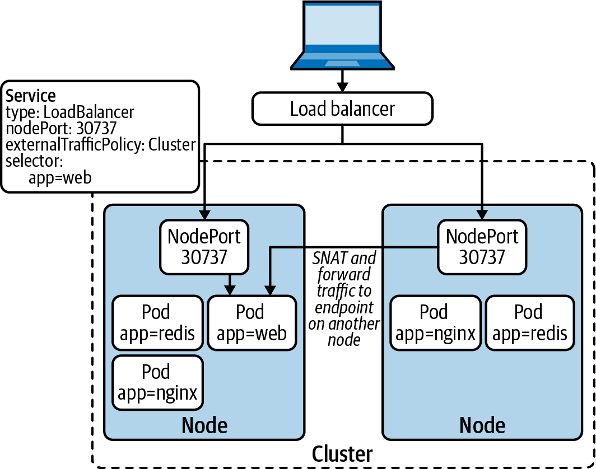

# Description
When we deploy a service with type=Loadbalancer, we can specify the External Traffic Policy: local/cluster. The external traffic policy determines whether the Service routes external traffic to node-local endpoints (externalTrafficPolicy: Local) or cluster-wide endpoints (externalTrafficPolicy: Cluster). What is the difference.
# Cluster (default)
Below image is copied from book: Production-kubernetes. 


Service configuration
```bash
Name:                     httpservice-lb
Namespace:                default
Labels:                   <none>
Annotations:              <none>
Selector:                 app.kubernetes.io/name=httpserver
Type:                     LoadBalancer
IP Family Policy:         SingleStack
IP Families:              IPv4
IP:                       10.96.111.34
IPs:                      10.96.111.34
Port:                     http  80/TCP
TargetPort:               8080/TCP
NodePort:                 http  32541/TCP
Endpoints:                192.168.178.7:8080,192.168.178.8:8080,192.168.238.70:8080
Session Affinity:         None
External Traffic Policy:  Cluster
```

## Benefits
Traffic is load balnced in cluster wide
## Drawback
1. If the traffic need be balanced from one node to another node, then SNAT and forward traffic is involved. It means extra network hop.
2. Loss of the source IP due to SNAT


# Local
Local means the service routes external traffic to **Node-Local** endpoints.
Below image is copied from book: Production-kubernetes. 
The external LB runs healthcheck against the nodes.

The service described as below (please ignore the external-ip) as I haven't setup the external IP yet.
```bash
sarah@sarah-510-p127c:~/k8s_ansible$ k get service httpservice-lb
NAME             TYPE           CLUSTER-IP     EXTERNAL-IP   PORT(S)        AGE
httpservice-lb   LoadBalancer   10.96.111.34   <pending>     80:32541/TCP   9m29s
```
As we can see from the output, the port 80:32541, so under the hood it uses NodePort. 
## Pro
1. No extra SNAT invovoled, less network hop
## Con
1. The traffic is not balanced. For example, node#1 has 2 endpoints, each endpoint receive 50% of the traffic, and node#2 has 1 endpoint, each endpoint receive 100% of the traffic.